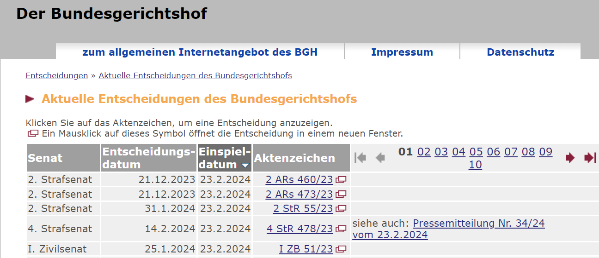

# Bundesgerichtshof Decisions Scraper

   

This Python script for `bundesgerichtshof_table_scrapper.py`is designed to collect judicial decisions table from from the Bundesgerichtshof (Federal Court of Justice of Germany) website avialable in `https://juris.bundesgerichtshof.de/cgi-bin/rechtsprechung/list.py?Gericht=bgh&Art=en`. It gathers basic information on judicial decisions, including the senate, decision date, filing date, case number, and additional information, and saves it to a CSV file.




## 🚀 Features:
- Searches data from multiple pages of Bundesgerichtshof decisions.
- Extracts unique identifiers from URLs for further processing.
- Saves the scraped data into a CSV file for easy access and analysis.

## 📋 Requirements:
- `Python 3.7+`
- `requests` for making HTTP requests.
- `BeautifulSoup` for parsing HTML content.
- `pandas` for data manipulation and CSV file generation


## 💾 Instalation

Install the necessary Python packages using pip:

```bash
pip install requests beautifulsoup4 pandas
```
## 📖 Scripts Overview

- **URL Construction**: Combines the base URL, common path, and page numbers to iterate through the decision listings.
- **Data Extraction**: Uses requests and BeautifulSoup to parse HTML content and extract decision details.
- **Unique Identifier Extraction**: Extracts unique identifiers from URLs for detailed analysis or reference.
- **Data Aggregation**: Compiles the extracted data into a pandas DataFrame.
- **CSV Export**: Saves the DataFrame to a CSV file, making the data accessible for further analysis or reporting.

## 📄 Output

The script generates a CSV file containing columns for Senate, Decision Date, Filing Date, Case Number, Additional Information, Unique Number, and URLs for the case number and additional information.

## 🤝 Contribution

Feel free to fork this project, submit pull requests, or report bugs and suggestions in the issues section.

## 📜 License

This project is open source and available under the MIT License.
